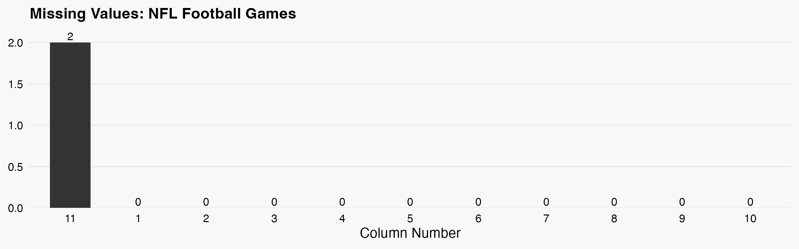

 
## NFL Games

 Retrieves NFL game data from espn's api and other sources. The combined data is processed into a structured dataframe and saved to a CSV file. 

**Function:** `football-games-nfl::get_formated_data()` 

**Records:** `670 games`

### Returned Data Structure

| # | Column | Type | Description |
|----|--------|------|-------------|
| 1 | id | string | A generated unique identifier for each game |
| 2 | espn_id | string | ESPN-assigned game ID |
| 3 | type | string | Sport type code (e.g., "FB" for football) |
| 4 | date | string | Date and time of the game |
| 5 | season | int | Season year |
| 6 | title | string | Full title of the game |
| 7 | short_tile | string | Shortened title of the game |
| 8 | venue | string | Venue where the game is played |
| 9 | home_espn_id | string | ESPN ID for the home team |
| 10 | away_espn_id | string | ESPN ID for the away team |
| 11 | play_by_play | string | URL to the game's play-by-play JSON data |

| Sources |
|--------|
| https://site.api.espn.com/ |

## College Football Games

 Retrieves college football game data from ESPN's API and other sources. The combined data is processed into a structured dataframe and saved to a CSV file. 

**Function:** `football-games-college::get_formated_data()` 

**Records:** `1880 games`

### Returned Data Structure

| # | Column | Type | Description |
|----|--------|------|-------------|
| 1 | id | string | A generated unique identifier for each game |
| 2 | espn_id | string | ESPN-assigned game ID |
| 3 | type | string | Sport type code (e.g., "FB" for football) |
| 4 | date | string | Date and time of the game |
| 5 | season | int | Season year |
| 6 | title | string | Full title of the game |
| 7 | short_tile | string | Shortened title of the game |
| 8 | venue | string | Venue where the game is played |
| 9 | home_espn_id | string | ESPN ID for the home team |
| 10 | away_espn_id | string | ESPN ID for the away team |
| 11 | play_by_play | string | URL to the game's play-by-play JSON data |

| Sources |
|--------|
| https://site.api.espn.com/ |

## College Baseball Games

 Retrieves college baseball game data from ESPN's API and other sources. The combined data is processed into a structured dataframe and saved to a CSV file. 

**Function:** `baseball-games-college::get_formated_data()` 

**Records:** `6375 games`

### Returned Data Structure

| # | Column | Type | Description |
|----|--------|------|-------------|
| 1 | id | string | A generated unique identifier for each game |
| 2 | espn_id | string | ESPN-assigned game ID |
| 3 | type | string | Sport type code (e.g., "FB" for football) |
| 4 | date | string | Date and time of the game |
| 5 | season | int | Season year |
| 6 | title | string | Full title of the game |
| 7 | short_tile | string | Shortened title of the game |
| 8 | venue | string | Venue where the game is played |
| 9 | home_espn_id | string | ESPN ID for the home team |
| 10 | away_espn_id | string | ESPN ID for the away team |
| 11 | play_by_play | string | URL to the game's play-by-play JSON data |

| Sources |
|--------|
| https://site.api.espn.com/ |

## College Basketball Games

 Retrieves college basketball game data from ESPN's API and other sources. The combined data is processed into a structured dataframe and saved to a CSV file. 

**Function:** `basketball-games-college::get_formated_data()` 

**Records:** `2062 games`

### Returned Data Structure

| # | Column | Type | Description |
|----|--------|------|-------------|
| 1 | id | string | A generated unique identifier for each game |
| 2 | espn_id | string | ESPN-assigned game ID |
| 3 | type | string | Sport type code (e.g., "FB" for football) |
| 4 | date | string | Date and time of the game |
| 5 | season | int | Season year |
| 6 | title | string | Full title of the game |
| 7 | short_tile | string | Shortened title of the game |
| 8 | venue | string | Venue where the game is played |
| 9 | home_espn_id | string | ESPN ID for the home team |
| 10 | away_espn_id | string | ESPN ID for the away team |
| 11 | play_by_play | string | URL to the game's play-by-play JSON data |

| Sources |
|--------|
| https://site.api.espn.com/ |

## NBA Basketball Games

 Retrieves NBA basketball game data from ESPN's API and other sources. The combined data is processed into a structured dataframe and saved to a CSV file. 

**Function:** `basketball-games-nba::get_formated_data()` 

**Records:** `2768 games`

### Returned Data Structure

| # | Column | Type | Description |
|----|--------|------|-------------|
| 1 | id | string | A generated unique identifier for each game |
| 2 | espn_id | string | ESPN-assigned game ID |
| 3 | type | string | Sport type code (e.g., "BK" for basketball) |
| 4 | date | string | Date and time of the game |
| 5 | season | int | Season year |
| 6 | title | string | Full title of the game |
| 7 | short_tile | string | Shortened title of the game |
| 8 | venue | string | Venue where the game is played |
| 9 | home_espn_id | string | ESPN ID for the home team |
| 10 | away_espn_id | string | ESPN ID for the away team |
| 11 | play_by_play | string | URL to the game's play-by-play JSON data |

| Sources |
|--------|
| https://site.api.espn.com/ |

## MLB Baseball Games

 Retrieves MLB baseball game data from ESPN's API and other sources. The combined data is processed into a structured dataframe and saved to a CSV file. 

**Function:** `baseball-games-mlb::get_formated_data()` 

**Records:** `6054 games`

### Returned Data Structure

| # | Column | Type | Description |
|----|--------|------|-------------|
| 1 | id | string | A generated unique identifier for each game |
| 2 | espn_id | string | ESPN-assigned game ID |
| 3 | type | string | Sport type code (e.g., "BS" for baseball) |
| 4 | date | string | Date and time of the game |
| 5 | season | int | Season year |
| 6 | title | string | Full title of the game |
| 7 | short_tile | string | Shortened title of the game |
| 8 | venue | string | Venue where the game is played |
| 9 | home_espn_id | string | ESPN ID for the home team |
| 10 | away_espn_id | string | ESPN ID for the away team |
| 11 | play_by_play | string | URL to the game's play-by-play JSON data |

| Sources |
|--------|
| https://site.api.espn.com/ |

