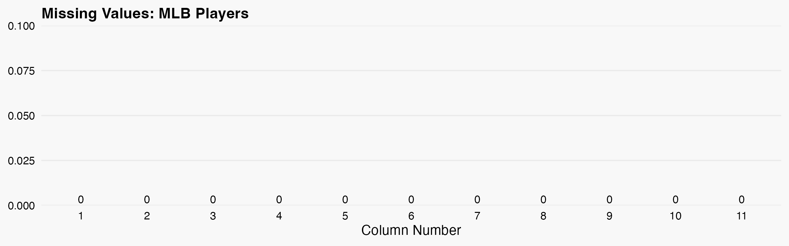
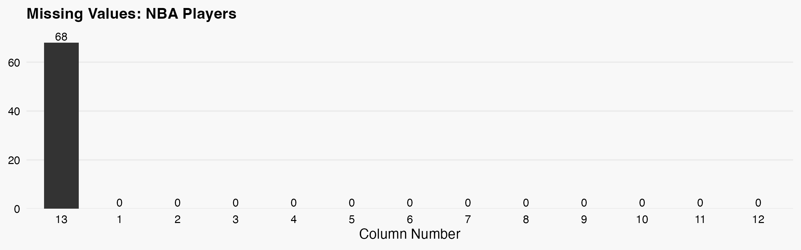
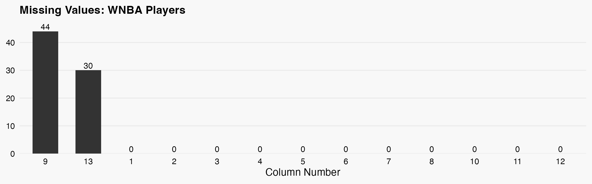
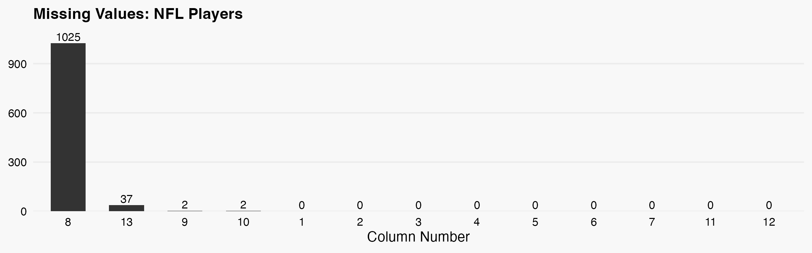

## MLB Players

 Retrieves Major Leaugue baseball players from espn's API and other sources. The combined data is processed into a structured dataframe and saved to a CSV file. 

**Function:** `baseball-players-mlb::get_formated_data()` 

**Records:** `785 players`

### Returned Data Structure

| # | Column | Type | Description |
|----|--------|------|-------------|
| 1 | id | int | A generated unique identifier for each team |
| 2 | espn_id | int | id used be espn to identify player |
| 3 | first_name | string | first name of player |
| 4 | last_name | string | last name of player |
| 5 | full_name | string | first and last name of player |
| 6 | short_name | string | shortand version of the players name |
| 7 | headshot | string | url to players headshot |
| 8 | position | string | position abv of player |
| 9 | bats | string | which hand the player bats with (right/left/both) |
| 10 | throws | string | which hand the player throws with (right/left/both) |
| 11 | team_espn_id | int | id used be espn to identify players team |

| Sources |
|--------|
| https://site.api.espn.com/ |
---
## NBA Players

 Retrieves National Basketball Association players from espn's API and other sources. The combined data is processed into a structured dataframe and saved to a CSV file. 

**Function:** `basketball-players-nba::get_formated_data()` 

**Records:** `544 players`

### Returned Data Structure

| # | Column | Type | Description |
|----|--------|------|-------------|
| 1 | id | int | A generated unique identifier for each team |
| 2 | espn_id | int | id used be espn to identify player |
| 3 | first_name | string | first name of player |
| 4 | last_name | string | last name of player |
| 5 | full_name | string | first and last name of player |
| 6 | short_name | string | shortand version of the players name |
| 7 | headshot | string | url to players headshot |
| 8 | jersey | int | jersey number for player |
| 9 | height | int | height of player |
| 10 | position | string | position abv of player |
| 11 | team_espn_id | int | id used be espn to identify players team |
| 12 | college_espn_id | int | id used be espn to identify players college team |

| Sources |
|--------|
| https://site.api.espn.com/ |
---
## WNBA Players

 Retrieves Womens National Basketball Association players from espn's API and other sources. The combined data is processed into a structured dataframe and saved to a CSV file. 

**Function:** `basketball-players-wnba::get_formated_data()` 

**Records:** `163 players`

### Returned Data Structure

| # | Column | Type | Description |
|----|--------|------|-------------|
| 1 | id | int | A generated unique identifier for each team |
| 2 | espn_id | int | id used be espn to identify player |
| 3 | first_name | string | first name of player |
| 4 | last_name | string | last name of player |
| 5 | full_name | string | first and last name of player |
| 6 | short_name | string | shortand version of the players name |
| 7 | headshot | string | url to players headshot |
| 8 | jersey | int | jersey number for player |
| 9 | height | int | height of player |
| 10 | position | string | position abv of player |
| 11 | team_espn_id | int | id used be espn to identify players team |
| 12 | college_espn_id | int | id used be espn to identify players college team |

| Sources |
|--------|
| https://site.api.espn.com/ |
---
## NFL Players

 Retrieves National Football League players from espn's API and other sources. The combined data is processed into a structured dataframe and saved to a CSV file. 

**Function:** `football-players-nfl::get_formated_data()` 

**Records:** `2921 players`

### Returned Data Structure

| # | Column | Type | Description |
|----|--------|------|-------------|
| 1 | id | int | A generated unique identifier for each team |
| 2 | espn_id | int | id used be espn to identify player |
| 3 | first_name | string | first name of player |
| 4 | last_name | string | last name of player |
| 5 | full_name | string | first and last name of player |
| 6 | short_name | string | shortand version of the players name |
| 7 | headshot | string | url to players headshot |
| 8 | jersey | int | jersey number for player |
| 9 | height | int | height of player |
| 10 | position | string | position abv of player |
| 11 | team_espn_id | int | id used be espn to identify players team |
| 12 | college_espn_id | int | id used be espn to identify players college team |

| Sources |
|--------|
| https://site.api.espn.com/ |

