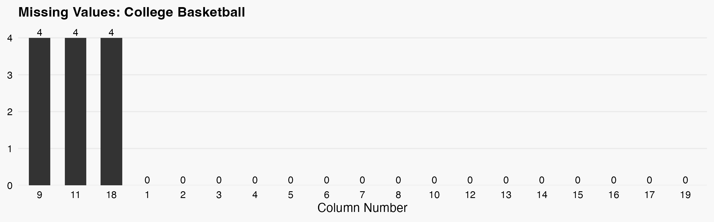
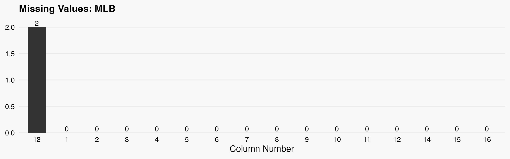

---
## NFL Teams

 Retrieves NFL team data from ESPN's API and supplements it with additional information scraped from the wiki team pages and official nfl webpages. The combined data is processed into a structured dataframe and saved to a CSV file. 

**Function:** `football-teams-nfl::get_formated_data()` 

**Records:** `32 teams`

### Returned Data Structure

| # | Column | Type | Description |
|----|--------|------|-------------|
| 1 | id | string | A generated unique identifier for each team |
| 2 | espn_id | int | id used be espn to identify team |
| 3 | type | string | Always set to NBA for team type |
| 4 | abv | string | Abreviation of team name (ex. DEN) |
| 5 | full_name | string | Full name of team (ex. Denver Nuggets) |
| 6 | short_name | string | Short name of team (ex. Nuggets) |
| 7 | primary | string | Primary color of team uniforms in Hex format |
| 8 | secondary | string | Secondary color of team uniforms in Hex format |
| 9 | logo | string | Link to logo image from ESPN |
| 10 | conference | string | Conference team is associated with (ex. Western) |
| 11 | division | string | Division team is associated with (ex. Northwest) |
| 12 | webiste | string | Website url for team |
| 13 | head_coach | string | Current head coach of team |
| 14 | offensive_coordinator | string | Current offensive coordinator of team |
| 15 | defensive_coordinator | string | Current defensive coordinator of team |
| 16 | general_manager | string | Current general manager of team |
| 17 | venue | string | Current venue where team plays |

| Sources |
|--------|
| https://site.api.espn.com/ |
| https://en.wikipedia.org/wiki/ |
| https://www.nfl.com/teams/ |
---
## College Football Teams

 Retrieves college football team data from ESPN's API and supplements it with additional information scraped from NCAA and CollegeFootballlDB. The combined data is processed into a structured dataframe and saved to a CSV file. 

**Function:** `football-teams-college::get_formated_data()` 

**Records:** `638 teams`

### Returned Data Structure

| # | Column | Type | Description |
|----|--------|------|-------------|
| 1 | id | string | A generated unique identifier for each team |
| 2 | espn_id | int | id used be espn to identify team |
| 3 | ncaa_id | string | id used be ncaa to identify team |
| 4 | type | string | Always set to NCAAB for team type |
| 5 | slug | string | Slug used to identify teams |
| 6 | abv | string | Abreviation of team name (ex. TOW) |
| 7 | full_name | string | Full name of team (ex. Towson Tigers) |
| 8 | short_name | string | Short name of team (ex. Tigers) |
| 9 | university | string | Uniersity team is located (ex. Towson) |
| 10 | division | string | Division team is associated with (ex. I) |
| 11 | conference | string | Conference team is associated with (ex. Big West) |
| 12 | primary | string | Primary color of team uniforms in Hex format |
| 13 | secondary | string | Secondary color of team uniforms in Hex format |
| 14 | logo | string | Link to logo image from ESPN |
| 15 | head_coach | string | Current head coach of team |
| 16 | offensive_coordinator | string | Current offensive coordinator of team |
| 17 | defensive_coordinator | string | Current defensive coordinator of team |
| 18 | school_url | string | NCAA url for team |
| 19 | website | string | Website url for teams school |
| 20 | venue | string | Current venue where team plays |

| Sources |
|--------|
| https://site.api.espn.com/ |
| https://www.ncaa.com/stats/football/ |
| https://en.wikipedia.org/wiki/ |
---
## NBA Teams

 Retrieves NBA team data from ESPN's API and supplements it with additional information scraped from the wiki team pages. The combined data is processed into a structured dataframe and saved to a CSV file. 

**Function:** `basketball-teams-nba::get_formated_data()` 

**Records:** `30 teams`

### Returned Data Structure

| # | Column | Type | Description |
|----|--------|------|-------------|
| 1 | id | string | A generated unique identifier for each team |
| 2 | espn_id | int | id used be espn to identify team |
| 3 | type | string | Always set to NBA for team type |
| 4 | abv | string | Abreviation of team name (ex. DEN) |
| 5 | full_name | string | Full name of team (ex. Denver Nuggets) |
| 6 | short_name | string | Short name of team (ex. Nuggets) |
| 7 | division | string | Division team is associated with (ex. Northwest) |
| 8 | conference | string | Conference team is associated with (ex. Western) |
| 9 | primary | string | Primary color of team uniforms in Hex format |
| 10 | secondary | string | Secondary color of team uniforms in Hex format |
| 11 | logo | string | Link to logo image from ESPN |
| 12 | head_coach | string | Current head coach of team |
| 13 | general_manager | string | Current general manager of team |
| 14 | twitter | string | Twitter handle of team starting with '@' |
| 15 | webiste | string | Website url for team |
| 16 | venue | string | Current venue where team plays |

| Sources |
|--------|
| https://site.api.espn.com/ |
| https://en.wikipedia.org/wiki/ |
---
## College Basketball Teams

 Retrieves college basketball team data from ESPN's API and supplements it with additional information scraped from NCAA and Wiki. The combined data is processed into a structured dataframe and saved to a CSV file. 

**Function:** `basketball-teams-college::get_formated_data()` 

**Records:** `355 teams`

### Returned Data Structure

| # | Column | Type | Description |
|----|--------|------|-------------|
| 1 | id | int | A generated unique identifier for each team |
| 2 | espn_id | string | id used be espn to identify team |
| 3 | ncaa_id | string | id used be ncaa to identify team |
| 4 | type | string | Always set to NCAAB for team type |
| 5 | slug | string | Slug used to identify teams |
| 6 | abv | string | Abreviation of team name (ex. TOW) |
| 7 | full_name | string | Full name of team (ex. Towson Tigers) |
| 8 | short_name | string | Short name of team (ex. Tigers) |
| 9 | university | string | University team is located at (ex. Towson) |
| 10 | division | string | Division team is associated with (ex. I) |
| 11 | conference | string | Conference team is associated with (ex. Big West) |
| 12 | primary | string | Primary color of team uniforms in Hex format |
| 13 | secondary | string | Secondary color of team uniforms in Hex format |
| 14 | logo | string | Link to logo image from ESPN |
| 15 | head_coach | string | Current head coach of team |
| 16 | school_url | string | NCAA url for team |
| 17 | website | string | Website url for teams school |
| 18 | twitter | string | Twitter handle of team starting with '@' |
| 19 | venue | string | Current venue where team plays |

| Sources |
|--------|
| https://site.api.espn.com/ |
| https://www.ncaa.com/stats/basketball-men/ |
| https://en.wikipedia.org/wiki/ |
---
## MLB Teams

 Retrieves MLB team data from ESPN's API and supplements it with additional information scraped from the wiki team pages. The combined data is processed into a structured dataframe and saved to a CSV file. 

**Function:** `baseball-teams-mlb::get_formated_data()` 

**Records:** `30 teams`

### Returned Data Structure

| # | Column | Type | Description |
|----|--------|------|-------------|
| 1 | id | string | A generated unique identifier for each team |
| 2 | espn_id | int | id used be espn to identify team |
| 3 | type | string | Always set to NBA for team type |
| 4 | abv | string | Abreviation of team name (ex. DEN) |
| 5 | full_name | string | Full name of team (ex. Denver Nuggets) |
| 6 | short_name | string | Short name of team (ex. Nuggets) |
| 7 | league | string | League team is associated with (ex. National League) |
| 8 | division | string | Division team is associated with (ex. Central Division) |
| 9 | primary | string | Primary color of team uniforms in Hex format |
| 10 | secondary | string | Secondary color of team uniforms in Hex format |
| 11 | logo | string | Link to logo image from ESPN |
| 12 | twitter | string | Twitter handle of team starting with '@' |
| 13 | webiste | string | Website url for team |
| 14 | general_manager | string | Current general manager of team |
| 15 | manager | string | Current manager of team |
| 16 | venue | string | Current venue where team plays |

| Sources |
|--------|
| https://site.api.espn.com/ |
| https://en.wikipedia.org/wiki/ |
---
## College Baseball Teams

 Retrieves college baseball team data from ESPN's API and supplements it with additional information scraped from NCAA and Wiki. The combined data is processed into a structured dataframe and saved to a CSV file. 

**Function:** `baseball-teams-college::get_formated_data()` 

**Records:** `296 teams`

### Returned Data Structure

| # | Column | Type | Description |
|----|--------|------|-------------|
| 1 | id | int | A generated unique identifier for each team |
| 2 | espn_id | string | id used be espn to identify team |
| 3 | ncaa_id | string | id used be ncaa to identify team |
| 4 | type | string | Always set to NCAAB for team type |
| 5 | slug | string | Slug used to identify teams |
| 6 | abv | string | Abreviation of team name (ex. TOW) |
| 7 | full_name | string | Full name of team (ex. Towson Tigers) |
| 8 | short_name | string | Short name of team (ex. Tigers) |
| 9 | university | string | University team is located at (ex. Towson) |
| 10 | division | string | Division team is associated with (ex. I) |
| 11 | conference | string | Conference team is associated with (ex. Big West) |
| 12 | primary | string | Primary color of team uniforms in Hex format |
| 13 | secondary | string | Secondary color of team uniforms in Hex format |
| 14 | logo | string | Link to logo image from ESPN |
| 15 | head_coach | string | Current head coach of team |
| 16 | school_url | string | NCAA url for team |
| 17 | website | string | Website url for teams school |
| 18 | twitter | string | Twitter handle of team starting with '@' |
| 19 | venue | string | Current venue where team plays |

| Sources |
|--------|
| https://site.api.espn.com/ |
| https://www.ncaa.com/stats/basketball-men/ |
| https://en.wikipedia.org/wiki/ |

