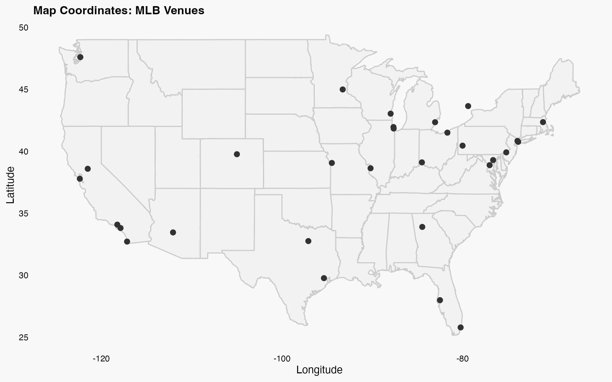

## MLB Venues

 Retrieves MLB venues data wiki pages. The combined data is processed into a structured dataframe and saved to a CSV file. 

**Function:** `baseball-venues-mlb::get_formated_data()` 

**Records:** `30 teams`

### Returned Data Structure

| # | Column | Type | Description |
|----|--------|------|-------------|
| 1 | id | string | A generated unique identifier for each venue |
| 2 | full_name | string | Full name of the venue |
| 3 | address | string | Venue address including city and state |
| 4 | latitude | string | Latitude in decimal degrees (e.g., 27.98028°N) |
| 5 | longitude | string | Longitude in decimal degrees (e.g., 82.50667°W) |
| 6 | capacity | string | Current official seating capacity |
| 7 | surface | string | Standardized playing surface type |
| 8 | roof | string | Roof type of the field |
| 9 | field_size_left | string | Left field distance in feet |
| 10 | field_size_left_center | string | Left-center field distance in feet |
| 11 | field_size_center | string | Center field distance in feet |
| 12 | field_size_right_center | string | Right-center field distance in feet |
| 13 | field_size_right | string | Right field distance in feet |

| Sources |
|--------|
| https://en.wikipedia.org/wiki/ |

