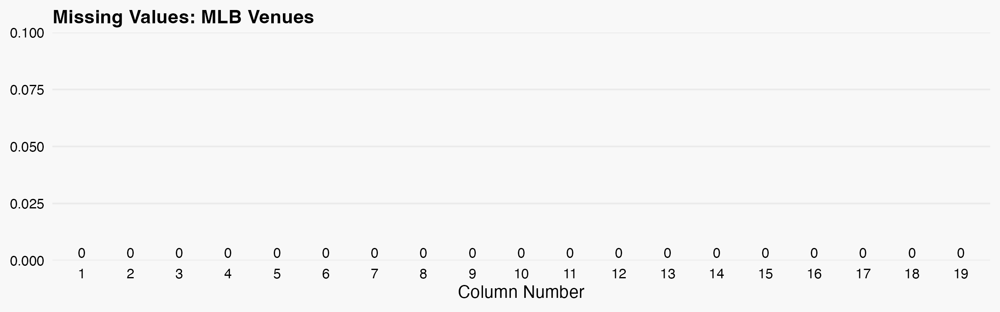

## MLB Venues

 Retrieves MLB venues data wiki pages. The combined data is processed into a structured dataframe and saved to a CSV file. 

**Function:** `baseball-venues-mlb::get_formated_data()` 

**Records:** `30 venues`

### Returned Data Structure

| # | Column | Type | Description |
|----|--------|------|-------------|
| 1 | id | string | A generated unique identifier for each venue |
| 2 | full_name | string | Full name of the venue |
| 3 | street_address | string | Street address of the venue |
| 4 | city | string | City where the venue is located |
| 5 | state | string | State where the venue is located |
| 6 | zip | string | Postal code of the venue |
| 7 | latitude | string | Latitude in decimal degrees (e.g., 27.98028) |
| 8 | longitude | string | Longitude in decimal degrees (e.g., -82.50667) |
| 9 | elevation | numeric | Elevation in meters above sea level |
| 10 | capacity | string | Current official seating capacity |
| 11 | opened | string | Year the venue was opened |
| 12 | surface | string | Standardized playing surface type |
| 13 | roof | string | Venue roof type |
| 14 | website | string | Official venue website URL |
| 15 | field_size_left | string | Left field distance in feet |
| 16 | field_size_left_center | string | Left-center field distance in feet |
| 17 | field_size_center | string | Center field distance in feet |
| 18 | field_size_right_center | string | Right-center field distance in feet |
| 19 | field_size_right | string | Right field distance in feet |

| Sources |
|--------|
| https://en.wikipedia.org/wiki/ |
---
## NFL Venues

 Retrieves NFL venues data from Wikipedia pages. The combined data is processed into a structured dataframe and saved to a CSV and RDS file. 

**Function:** `football-venues-nfl::get_formated_data()` 

**Records:** `30 venues`

### Returned Data Structure

| # | Column | Type | Description |
|----|--------|------|-------------|
| 1 | id | string | A generated unique identifier for each venue |
| 2 | full_name | string | Full name of the venue |
| 3 | street_address | string | Street address of the venue |
| 4 | city | string | City where the venue is located |
| 5 | state | string | State where the venue is located |
| 6 | zip | string | Postal code of the venue |
| 7 | latitude | string | Latitude in decimal degrees (e.g., 27.98028) |
| 8 | longitude | string | Longitude in decimal degrees (e.g., -82.50667) |
| 9 | elevation | numeric | Elevation in meters above sea level |
| 10 | capacity | string | Current official seating capacity |
| 11 | opened | string | Year the venue was opened |
| 12 | surface | string | Standardized playing surface type |
| 13 | roof | string | Venue roof type |
| 14 | website | string | Official venue website URL |

| Sources |
|--------|
| https://en.wikipedia.org/wiki/ |
---
## NBA Venues

 Retrieves NBA venues data from Wikipedia pages. The combined data is processed into a structured dataframe and saved to a CSV and RDS file. 

**Function:** `basketball-venues-nba::get_formated_data()` 

**Records:** `30 venues`

### Returned Data Structure

| # | Column | Type | Description |
|----|--------|------|-------------|
| 1 | id | string | A generated unique identifier for each venue |
| 2 | full_name | string | Full name of the venue |
| 3 | street_address | string | Street address of the venue |
| 4 | city | string | City where the venue is located |
| 5 | state | string | State where the venue is located |
| 6 | zip | string | Postal code of the venue |
| 7 | latitude | string | Latitude in decimal degrees (e.g., 27.98028) |
| 8 | longitude | string | Longitude in decimal degrees (e.g., -82.50667) |
| 9 | elevation | numeric | Elevation in meters above sea level |
| 10 | capacity | string | Current official seating capacity |
| 11 | opened | string | Year the venue was opened |
| 12 | website | string | Official venue website URL |

| Sources |
|--------|
| https://en.wikipedia.org/wiki/ |
---
## WNBA Venues

 Retrieves WNBA venues data from Wikipedia pages. The combined data is processed into a structured dataframe and saved to a CSV and RDS file. 

**Function:** `basketball-venues-wnba::get_formated_data()` 

**Records:** `13 venues`

### Returned Data Structure

| # | Column | Type | Description |
|----|--------|------|-------------|
| 1 | id | string | A generated unique identifier for each venue |
| 2 | full_name | string | Full name of the venue |
| 3 | street_address | string | Street address of the venue |
| 4 | city | string | City where the venue is located |
| 5 | state | string | State where the venue is located |
| 6 | zip | string | Postal code of the venue |
| 7 | latitude | string | Latitude in decimal degrees (e.g., 27.98028) |
| 8 | longitude | string | Longitude in decimal degrees (e.g., -82.50667) |
| 9 | elevation | numeric | Elevation in meters above sea level |
| 10 | capacity | string | Current official seating capacity |
| 11 | opened | string | Year the venue was opened |
| 12 | website | string | Official venue website URL |

| Sources |
|--------|
| https://en.wikipedia.org/wiki/ |
| https://en.wikipedia.org/wiki/ |
---
## College Baseball Venues

 Retrieves college baseball venues data wiki pages. The combined data is processed into a structured dataframe and saved to a CSV file. 

**Function:** `baseball-venues-college::get_formated_data()` 

**Records:** `290 venues`

### Returned Data Structure

| # | Column | Type | Description |
|----|--------|------|-------------|
| 1 | id | string | A generated unique identifier for each venue |
| 2 | full_name | string | Full name of the venue |
| 3 | street_address | string | Street address of the venue |
| 4 | city | string | City where the venue is located |
| 5 | state | string | State where the venue is located |
| 6 | zip | string | Postal code of the venue |
| 7 | latitude | string | Latitude in decimal degrees (e.g., 27.98028) |
| 8 | longitude | string | Longitude in decimal degrees (e.g., -82.50667) |
| 9 | elevation | numeric | Elevation in meters above sea level |
| 10 | capacity | string | Current official seating capacity |
| 11 | surface | string | Standardized playing surface type |
| 12 | field_size_left | string | Left field distance in feet |
| 13 | field_size_left_center | string | Left-center field distance in feet |
| 14 | field_size_center | string | Center field distance in feet |
| 15 | field_size_right_center | string | Right-center field distance in feet |
| 16 | field_size_right | string | Right field distance in feet |

| Sources |
|--------|
| https://en.wikipedia.org/wiki/ |
---
## College Basketball Venues

 Retrieves college basketball venues data from Wikipedia pages. The combined data is  processed into a structured dataframe and saved to a CSV and RDS file. 

**Function:** `basketball-venues-college::get_formated_data()` 

**Records:** `378 venues`

### Returned Data Structure

| # | Column | Type | Description |
|----|--------|------|-------------|
| 1 | id | string | A generated unique identifier for each venue |
| 2 | full_name | string | Full name of the venue |
| 3 | street_address | string | Street address of the venue |
| 4 | city | string | City where the venue is located |
| 5 | state | string | State where the venue is located |
| 6 | zip | string | Postal code of the venue |
| 7 | latitude | string | Latitude in decimal degrees (e.g., 27.98028) |
| 8 | longitude | string | Longitude in decimal degrees (e.g., -82.50667) |
| 9 | elevation | numeric | Elevation in meters above sea level |
| 10 | capacity | string | Current official seating capacity |
| 11 | opened | string | Year the venue was opened |

| Sources |
|--------|
| https://en.wikipedia.org/wiki/ |

